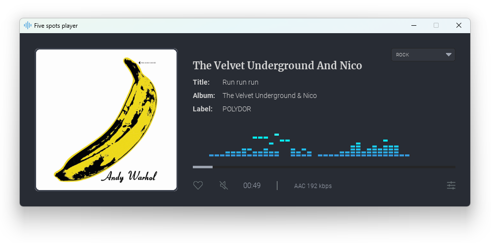
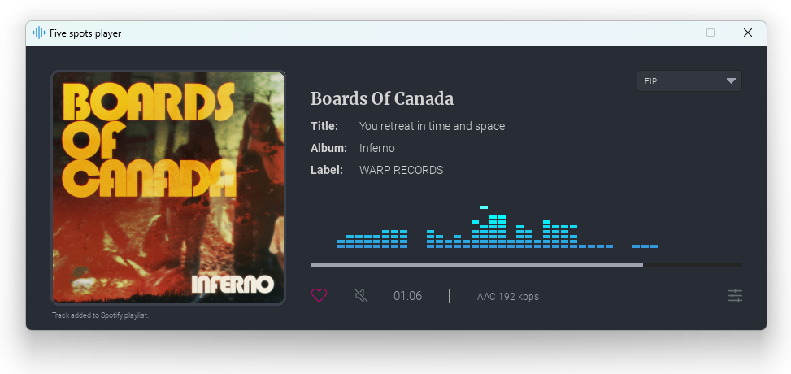
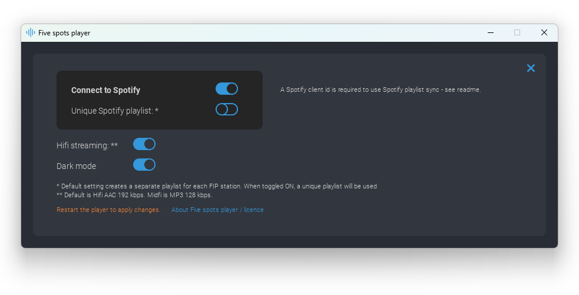

# Five spots player

Unofficial player for **FIP internet radio** (13 stations) : the world's most eclectic radio. Sync tracks to **Spotify playlists** with one click. 

Available for Windows and Linux.

_Five spots player is an independent desktop player for FIP radio, and is not affiliated with, endorsed by, or sponsored by Radio France or FIP. All trademarks, logos, and audio content remain the property of their respective owners. Audio streams are delivered directly from Radio France servers. This application does not store, retransmit, or modify these streams._

<br>
<br>


## Features
* **Listen** to 13 FIP stations: FIP, Jazz, Rock, Groove, World, New Releases, Reggae, Electro, Metal, Pop, Hip-Hop, Sacré Français, Cultes
* **Sync to Spotify**: like the currently playing track and sync it to a private Spotify playlist (one global playlist or one per station)
* **Like**: liked tracks are saved locally in a JSON file
* Streaming quality : AAC 192 kbps or midfi MP3

## Requirements
* [VLC media player](https://www.videolan.org/vlc/) installed on your system
* Recommended : a Radiofrance API key (to display covers and metadata) - see below
* Optional : A Spotify client ID (to sync live songs with playlists) - see below

### RadioFrance API Key

To display covers and metadata from Radiofrance API, you need an API key.

To request an API key:
* Go to the developer portal: Radio France Developers
* Create an account.
* Then, in the "My Account" section, click "Request an API Key".  
  
Create a `.env` file in the root folder next to five-spots-player.exe and copy this,  replacing your-radiofrance-api-token by your API key:
```
RADIOFRANCE_API_TOKEN=your-radiofrance-api-token
```

### Spotify client ID

To use the Spotify playlists synchronization features, you need to get your own Spotify  **Client ID**. This is free and only takes a few minutes.

* Open the page: https://developer.spotify.com/dashboard. Log in with your Spotify account.
* Click **Create app**, then fill in the fields:
* **App name**: the name of your choice (for example `Radio player`)
* **App description**: Radio player
* **Redirect URI**: use the following URL: `http://127.0.0.1:8080`
* Once the application is created, copy the **Client ID** value.

Open the `.env` file (or create one if it not exists) in the root folder next to five-spots-player.exe and replace your-spotify-client-id by your Spotify client id:
```
RADIOFRANCE_API_TOKEN=your-radiofrance-api-token
SPOTIPY_CLIENT_ID=your-spotify-client-id
```
Then you can toggle on "Connect to Spoptify" in the Settings screen and restart the app.

**Enjoy!**

## Settings
| Setting | Description |
|---|---|
| Spotify sync | Connect your Spotify account to sync liked tracks to playlists and fetch album covers |
| Unique playlist | Use a single global playlist instead of one per station |
| Hi-fi | Toggle between AAC 192 kbps (hifi) and MP3 (midfi) |

<br>

# Developers

## Run from source

Create a virtual environment and install the dependencies.

```bash
pip install -r requirements.txt
```

```bash
python main.py
```

## Build executable

Requires [VLC media player](https://www.videolan.org/vlc/) (64-bit) installed and PyInstaller:

### Windows

```bash
pip install pyinstaller
pyinstaller five_spots_player.spec
```

### Linux

```bash
venv/bin/pip install pyinstaller
venv/bin/pyinstaller --clean -y five_spots_player.spec
```

The output is in `dist/five-spots-player/`. 

#### Build with Docker (Ubuntu 22.04 / Python 3.12)

A `Dockerfile` is provided to build the Linux bundle in a clean Ubuntu 22.04 image
with Python 3.12 (via the deadsnakes PPA), so the binary doesn't depend on the host setup.

```bash
docker build -t five-spots-build .
```

To extract the bundle, **package it as a `.tar.gz` inside the container, then copy that
single file out**. Do **not** `docker cp` the whole `dist/` folder on Windows (its
`pygame_ce` symlinks can't be created on NTFS without admin privilege, which aborts the
copy and drops the executable), and do **not** redirect `tar` through PowerShell's `>`
(it re-encodes the stream as UTF-16 and corrupts the archive — `gzip: not in gzip
format`). The two-step approach below avoids both pitfalls (works in PowerShell and bash):

```bash
docker run --name fsp-pack five-spots-build sh -c 'cd /app/dist && tar czf /tmp/fsp.tar.gz five-spots-player-1.0.0'
docker cp fsp-pack:/tmp/fsp.tar.gz ./dist/five-spots-player-1.0.0-linux-x86_64.tar.gz
docker rm fsp-pack
```

> On Linux/macOS or Git Bash you can do it in one line instead:
> `docker run --rm five-spots-build sh -c 'cd /app/dist && tar czf - five-spots-player-1.0.0' > dist/five-spots-player-1.0.0-linux-x86_64.tar.gz`

Then on the target Linux machine:

```bash
tar xzf five-spots-player-1.0.0-linux-x86_64.tar.gz
cd five-spots-player-1.0.0
./five-spots-player-1.0.0
```

### Linux compatibility

Runs on any distribution whose **glibc is ≥ 2.35**. On every distribution, **VLC must be installed** (`libvlc` is intentionally not bundled) and a graphical session (X11/Wayland) is required.

> Ubuntu 22.04 LTS, Debian 12, Linux Mint 21, Pop!_OS 22.04, Fedora 36+ , openSUSE Leap 15.6 / Tumbleweed, Arch / Manjaro (rolling)...

_To support older distributions (e.g. Debian 11, Ubuntu 20.04, RHEL 9), rebuild from an older base by changing the `Dockerfile`'s first line to `FROM ubuntu:20.04` (glibc 2.31) — the binary then runs on everything with glibc ≥ 2.31._

## License

Licensed under the Apache License, Version 2.0. See [LICENSE.md](LICENSE.md) for the full text.

## Third party licences

### Libraries
* **Pygame** — GNU Lesser General Public License — https://github.com/pygame/pygame
* **python-vlc** — GNU Lesser General Public License — https://github.com/oaubert/python-vlc
* **Aiohttp** — Copyright aio-libs contributors, Apache License 2.0 — https://github.com/aio-libs/aiohttp
* **Spotipy** — Copyright (c) 2021 Paul Lamere, MIT License — https://github.com/spotipy-dev/spotipy
* **certifi** — Mozilla Public License 2.0 — https://github.com/certifi/python-certifi
* **python-decouple** — MIT License — https://github.com/HBNetwork/python-decouple
* **NumPy** — BSD 3-Clause License — https://github.com/numpy/numpy

### Fonts
* **Merriweather** — Copyright 2016 The Merriweather Project Authors, SIL Open Font License 1.1 — https://github.com/SorkinType/Merriweather
* **Roboto** — Apache License 2.0 — https://github.com/googlefonts/roboto

Audio streams and track metadata are provided by Radio France. This application is not affiliated with, endorsed by, or sponsored by Radio France or FIP.

